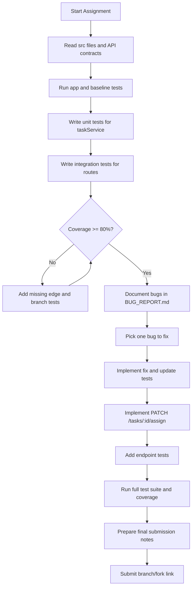
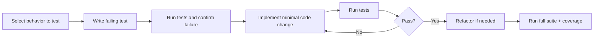
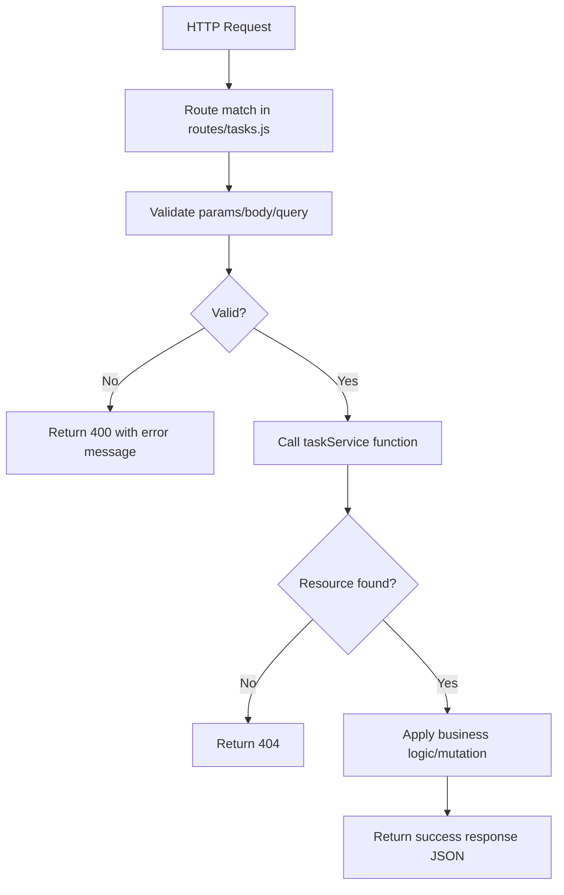
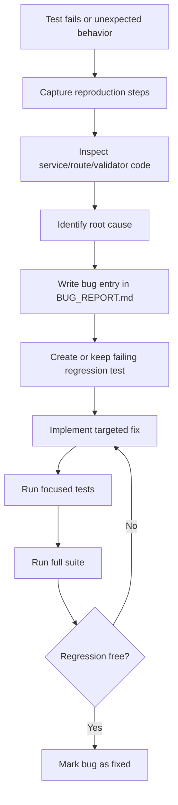
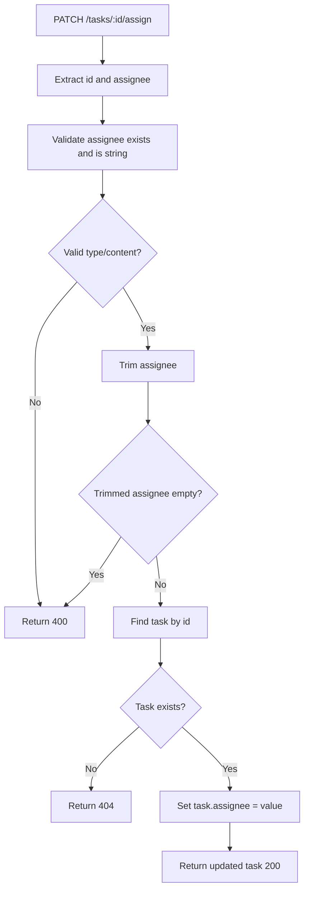
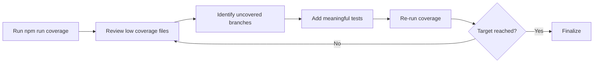
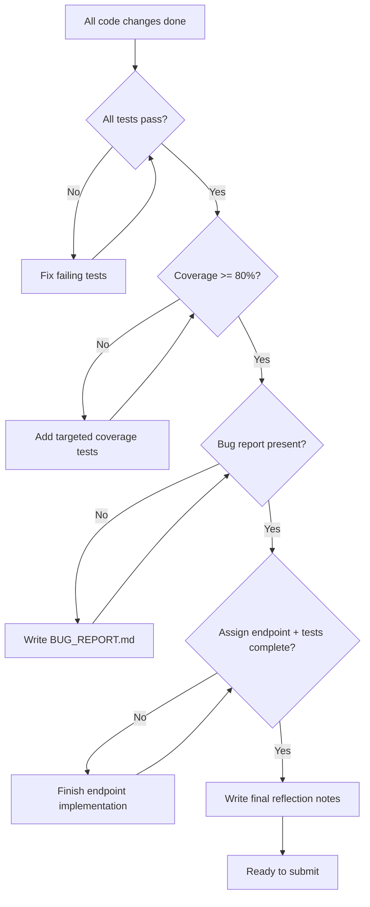

# Flow Diagrams - The Untested API

This document provides implementation and testing flows in Mermaid format.

---

## 1) Overall Development Workflow

---

## 2) Test Development Flow (TDD-leaning)

---

## 3) API Request Handling Flow

---

## 4) Bug Discovery and Fix Flow

---

## 5) New Endpoint Flow: PATCH /tasks/:id/assign

---

## 6) Coverage Improvement Loop

---

## 7) Submission Readiness Gate

